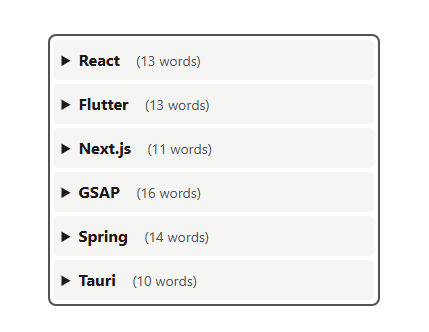

#Korgg

## Description

Korgg is a search engine for your notes. It allows you to search through your notes and find the information you need quickly and easily.

## Features

- Search through your notes
- Filter by keyword
- Show word count
- Underline on hover
- Open/Close accordion

## Built With

- [React](https://reactjs.org/) - The web framework used
- [Tailwind CSS](https://tailwindcss.com/) - For styling

## preview

## Contributing

Contributions are welcome! If you find any issues or have suggestions for improvements, please open an issue or submit a pull request on the GitHub repository.

## License

This project is licensed under the MIT License - see the [LICENSE.md](LICENSE.md) file for details.                                             

